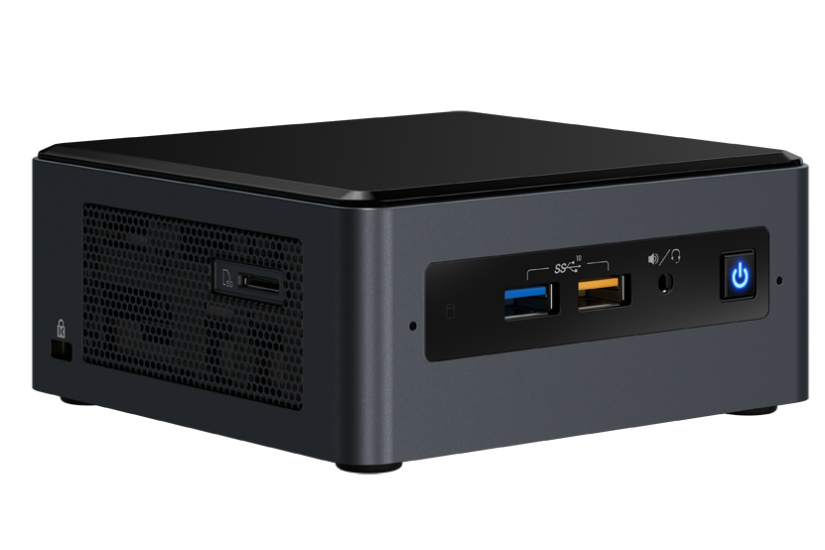

# Intel NUC8 BEH & BEK Hackintosh
## With Thunderbolt Hot-Plug Works without flashing

EFI for Intel NUC8 i3/i5/i7 BEH/BEK with OpenCore bootloader

### MY NUC8i3BEH Spec:

| Component        | Brank                                  |
| ---------------- | ---------------------------------------|
| CPU              | Intel® Core™ i3-8109U (2C-4T)          |
| iGPU             | Intel® Iris® Plus 655                  |
| Lan              | Intel I219-V                           |
| Audio            | Realtek ALC235                         |
| Ram              | 16 GB DDR4 2400 Mhz                    |
| Wifi + Bluetooth | Intel® Wireless-AC 9560 + Bluetooth 5.0|
| Nvme             | Samsung 970 EVO PLUS 500GB             |
| SSD              | SiliconPower A55 512 GB                |
| Card Reader.     | microSDXC Card Reader                  |
| SmBios           | MacMini8,1                             |
| BootLoader       | OpenCore 0.9.4 (Release)               |
| macOS Version    | Ventura Beta 13.6 (22G115)             |

## Peripherals

### What works and What doesn't or WIP:

- [x] Intel Intel® Iris® Plus 655 iGPU HDMI Output
- [x] ALC235 Internal Speakers
- [x] ALC235 HDMI Audio Output
- [x] All USB Ports 
- [x] SpeedStep / Sleep / Wake
- [x] Intel I219-V
- [x] Thunderbolt 3 port (hotplug without fw flash)
- [x] AC 9560 Wireless + Bluetooth
- [x] microSDXC Card Reader
- [x] NVRAM

## BIOS Settings:
To start, choose "Load Defaults" (choose from the menu or press F9 in the BIOS setup).

Then change:

### 1. Devices Section:

In "Onboard Devices" section → "Onboard Devices Configuration" panel → Set "SD Card" to Enabled.

In "USB" section → "USB Configuration" panel → Set "Portable Device Charging Mode" to "Off".

In "USB" section → "USB Ports" panel → Set both "USB2 Header Connector" ports to Enabled.

In "Video" section → "Video Configuration" panel → Confirm that "IGD Minimum Memory" is set as 64 MB.

In "Video" section → "Video Configuration" panel → Confirm that "IGD Aperture Size" is set to 256 MB.

In "Onboard Devices" section → "Legacy Device Configuration" panel → Set "Enhanced Consumer IR" to Disabled.

In "Onboard Devices" section → "Legacy Device Configuration" panel → Set "HDMI CEC Control" to Enabled.

### 3. SECURITY Section:

In "Security Features" section → Set "Intel VT for Directed I/O (VT-d)" to Enabled.

In "Security Features" section → Set "Intel Software Guard Extension (SGX)" to Disabled.

In "Security Features" section → Set "Thunderbolt Security Level" to "Legacy Mode".

### 5. POWER Section:

In "Secondary Power Settings" section → Set "Wake on LAN from S4/S5" to "Stay Off".

In "Secondary Power Settings" section → Set "PCIe ASPM Support" to Disabled.

### 7. BOOT Section:

In "Secure Boot" section → "Secure Boot Configuration" panel → Set "Secure Boot" to Disabled.

In "Boot Priority" section → "UEFI Boot Priority" panel → Confirm that "UEFI Boot" is Enabled.

In "Boot Configuration" section → "UEFI Boot" panel → Set "Fast Boot" to Disabled.

In "Boot Configuration" section → "UEFI Boot" panel → Set "Boot USB Devices First" to Enabled.

In "Boot Configuration" section → "UEFI Boot" panel → Set "Boot Network Devices Last" to Disabled.

In "Boot Configuration" section → "UEFI Boot" panel → Set "Startup Sound" to Disabled.

In "Boot Devices" section → "Boot Devices" panel → Set "Thunderbolt Boot" to Enabled.

In "Boot Devices" section → "Boot Devices" panel → Set "Optical Boot" to Disabled.

In "Boot Devices" section → "Boot Devices" panel → Set "Network Boot" to Disabled.

In "Boot Devices" section → "Boot Display Configuration" panel → Set "Display F7 to Update BIOS" to Disabled.

Press F10 to save and exit.

### Special Config:

- Usb port mapping performed

See [ioreg](https://raw.githubusercontent.com/Lorys89/Intel-NUC8-Hackintosh/main/IOREG-MacMini8%2C1.ioreg) for more clarification

## Credits

- [Apple](https://apple.com) for macOS.
- [Intel](https://www.intel.it/content/www/it/it/products/details/nuc.html) for this mini pc.
- [Acidanthera](https://github.com/acidanthera) for OpenCore and all the lovely hackintosh work.
